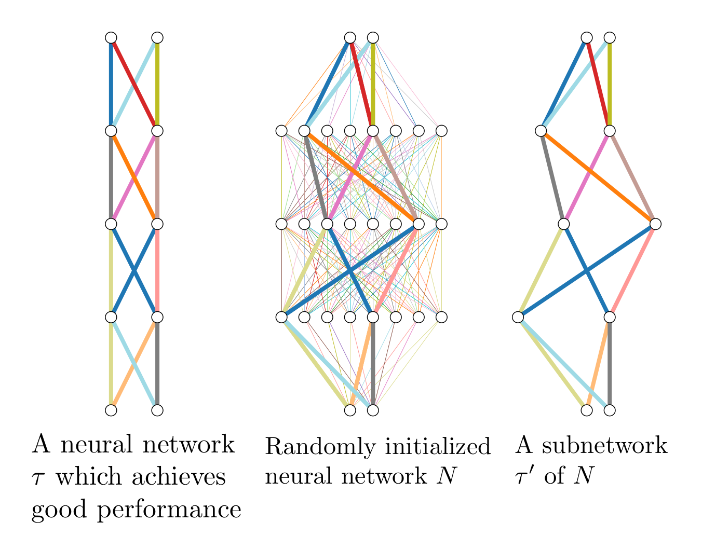
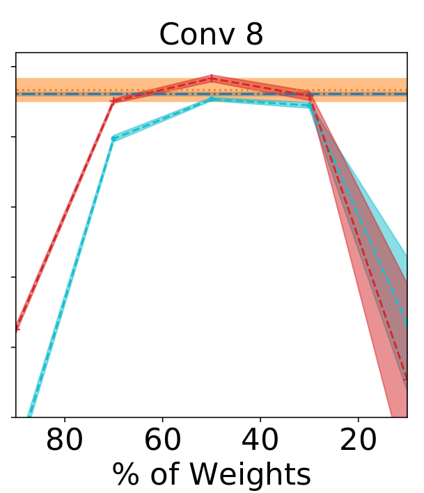
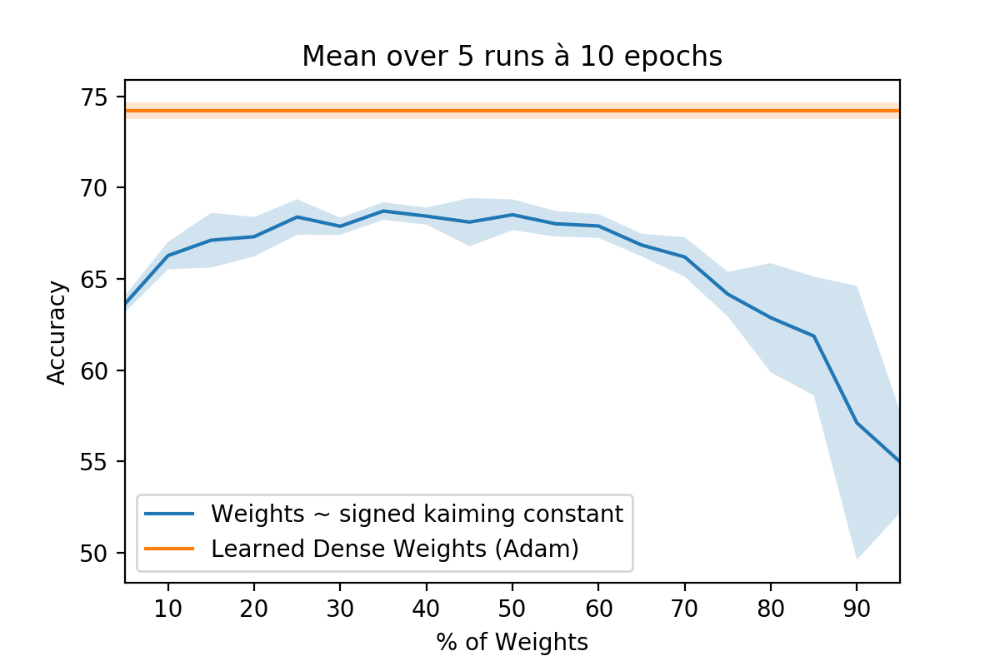

# edge-popup

**Unofficial** reproduction of the paper [What's Hidden in a Randomly Weighted Neural Network?](https://arxiv.org/abs/1911.13299).

Status: in development.

## Results

| Dataset | Arch | Epochs | edge-popup | Commit | Accuracy | # Runs |
|--|--|--|--|--|--|--|
|[Imagenette](https://github.com/fastai/imagenette)|`xresnet50`|5|yes|[55e34a6b](https://github.com/iceychris/edge-popup/tree/55e34a6bbabb5d536d3c8ee7e52b034df3f88e37)|76.18%|5, mean|
|[Imagenette](https://github.com/fastai/imagenette)|`xresnet50`|5|no|[55e34a6b](https://github.com/iceychris/edge-popup/tree/55e34a6bbabb5d536d3c8ee7e52b034df3f88e37)|80.94%|5, mean|
|[Imagenette](https://github.com/fastai/imagenette)|`xresnet50`|20|yes|[55e34a6b](https://github.com/iceychris/edge-popup/tree/55e34a6bbabb5d536d3c8ee7e52b034df3f88e37)|86.44%|5, mean|
|[Imagenette](https://github.com/fastai/imagenette)|`xresnet50`|20|no|[55e34a6b](https://github.com/iceychris/edge-popup/tree/55e34a6bbabb5d536d3c8ee7e52b034df3f88e37)|89.53%|5, mean|

Paper (`CIFAR-10`, `Conv 8`)            |  Reproduction (`Imagewoof`, `xresnet50`, [2f1f0b0d](https://github.com/iceychris/edge-popup/tree/2f1f0b0d1380321fd4dae725fd988ee7336e7c55))
:-------------------------:|:-------------------------:
  |  

## ToDo

- [ ] init
    - [x] signed kaiming constant
    - [ ] kaiming normal
- [ ] layers
    - [x] `Linear`
    - [x] `Conv2d`
    - [ ] `BatchNorm2d`
    - [ ] `LSTM`
- [ ] tests
    - [ ] initializations / variance
    
## Resources

- [[Video] Henry AI Labs - What's Hidden in a Randomly Weighted Neural Network?](https://youtu.be/C6Tj8anJO-Q)

## Contributing

Any contributions are welcome.

Feel free to file an `issue` or send a `pull request`.
